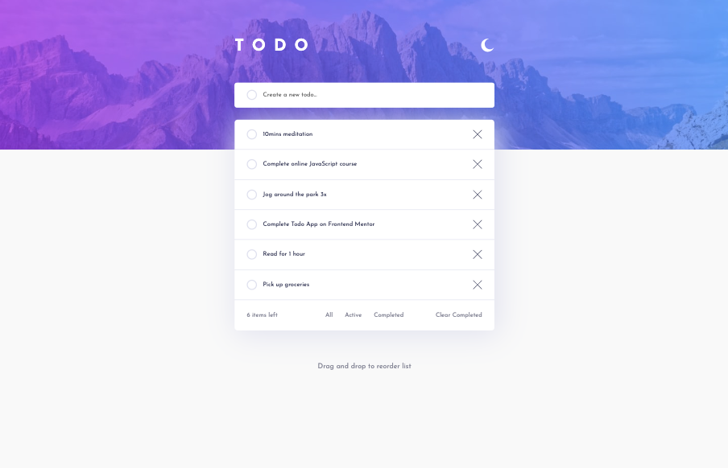
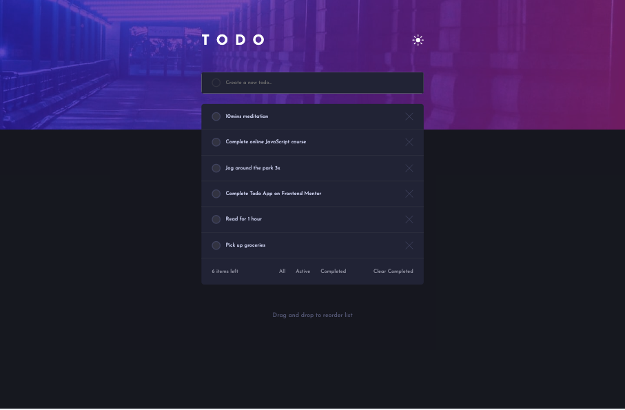
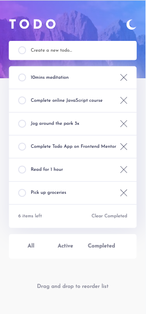
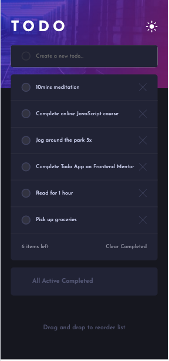

# Frontend Mentor - Todo app solution

This is a solution to the [Todo app challenge on Frontend Mentor](https://www.frontendmentor.io/challenges/todo-app-Su1_KokOW). Frontend Mentor challenges help you improve your coding skills by building realistic projects. 

## Table of contents

- [Overview](#overview)
  - [The challenge](#the-challenge)
  - [Screenshot](#screenshot)
  - [Links](#links)
- [My process](#my-process)
  - [Built with](#built-with)
  - [What I learned](#what-i-learned)
  - [Continued development](#continued-development)
  - [Useful resources](#useful-resources)
- [Author](#author)
- [Acknowledgments](#acknowledgments)

## Overview

### The challenge

Users should be able to:

- View the optimal layout for the app depending on their device's screen size
- See hover states for all interactive elements on the page
- Add new todos to the list
- Mark todos as complete
- Delete todos from the list
- Filter by all/active/complete todos
- Clear all completed todos
- Toggle light and dark mode
- **Bonus**: Drag and drop to reorder items on the list

### Screenshot






### Links

- Solution URL: [Github](https://github.com/mroungou/todo-app-main)
- Live Site URL: [Live Site](https://mroungou.github.io/todo-app-main/)

## My process

### Built with

- Semantic HTML5 markup
- CSS custom properties
- Flexbox
- CSS Grid
- Mobile-first workflow
- JavaScript

### What I learned

I learned a lot about using objects and arrays and how to use both of them and access them with the methods available to each. 

```js
const addTask = () => {
    // this will be used to check if there are any tasks with the same id - 
    // if there are none it will add if there are matches it will n ot
    const dataArrIndex = taskData.findIndex((item) => item.id === currentTask.id);

    const taskObj = {
        // creates a unique id for each task that is added - the date.now() method will
        // unique numbers from the year 1970 seconds elapsed
        id: `${todoInput.value.toLowerCase().split(" ").join("-")}-${Date.now()}`,
        title: todoInput.value,
        completed: false //adding a completed property - this tracks whether a task has been completed
    };

    // findIndex method will return -1 if there is no match found
    // if there is no match found I want to add using unshift at the beginning of the array
    if (dataArrIndex === -1) {
        taskData.unshift(taskObj)
        activeTasksCount.innerText = taskData.filter(task => !task.completed).length;
    } else {
        taskData[dataArrIndex] = taskObj;
    }

    localStorage.setItem("tasks", JSON.stringify(taskData));
    filteredTaskData = [...taskData];
    updateTasksContainer();
    reset();
}

const updateTasksContainer = () => {
    tasksContainer.innerHTML = "";
    activeTasksCount.innerText = taskData.filter(task => !task.completed).length;

    filteredTaskData.forEach(
        ({id, title, completed}) => {
        (tasksContainer.innerHTML += `
            <div class="item  ${completed ? 'done': ''}" id=${id}>
                <label class="form-control">
                    <input type="checkbox" ${completed ? 'checked' : ''} onclick="toggleCompleted(this)">
                    ${title}
                </label>
                
            </div>
        `)
        }
    );

};

```

### Continued development
It would be nice to eventually be able to make it into a full stack app and maybe one day a mobile app with notifications and all.

### Useful resources

- [FreeCodeCamp](https://www.freecodecamp.org/learn/javascript-algorithms-and-data-structures-v8/learn-localstorage-by-building-a-todo-app/step-65) - I learned a lot about arrays, objects and methods available for each of these data structures. Also learned the CRUD (create, read, update, delete) for local storage
## Author
- Twitter - [@mroungou](https://x.com/mroungou)
